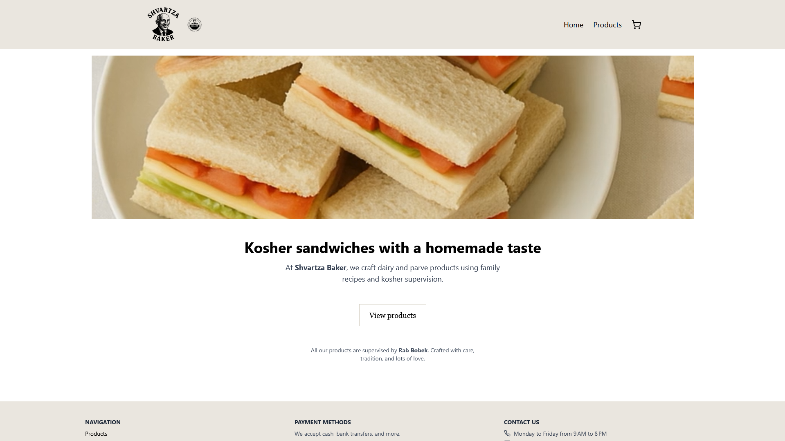
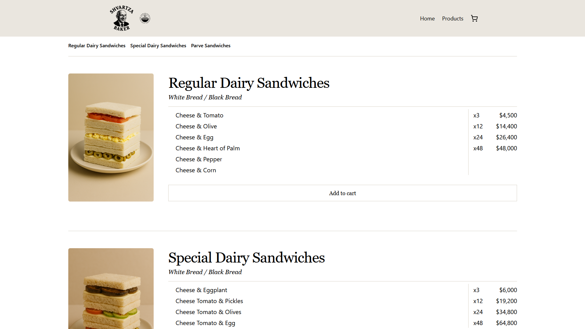
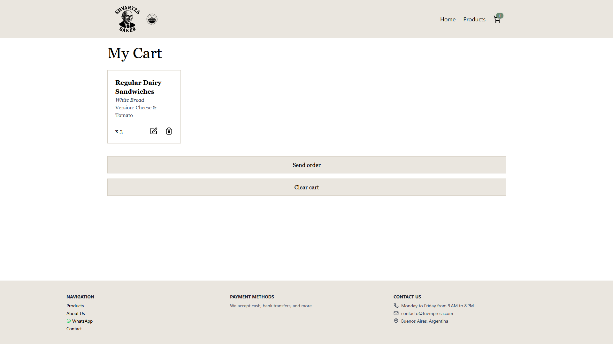
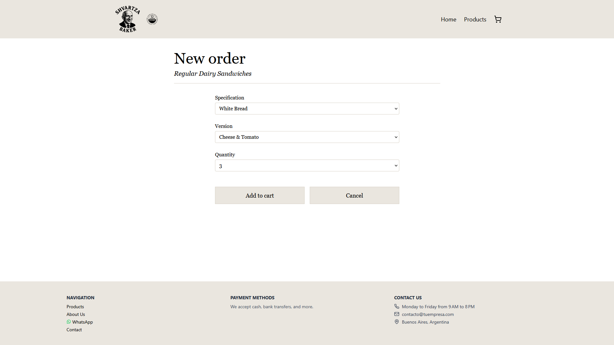
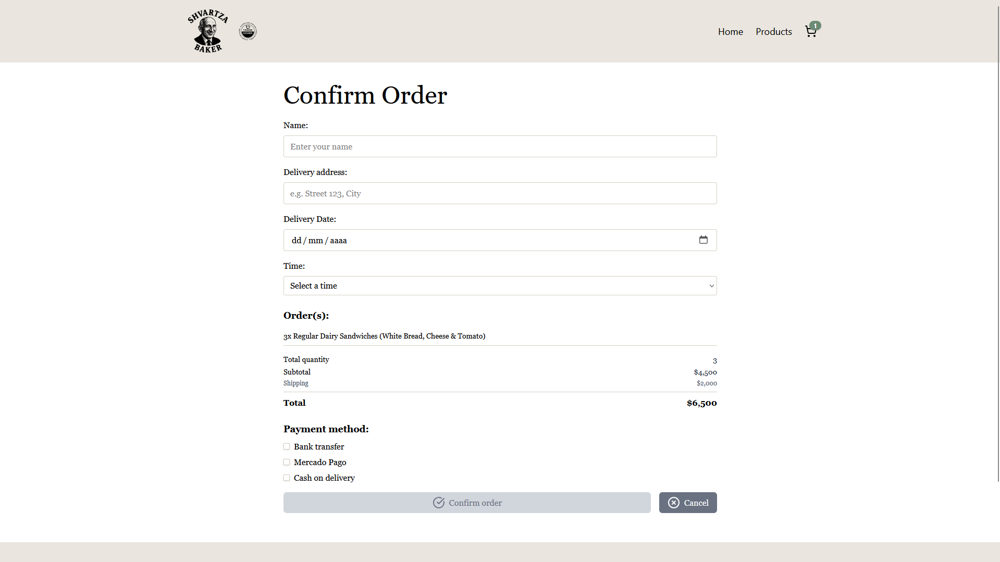

# shvartzabaker 🥯

A product showcase and ordering web app for a bakery, built with modern web technologies like React, TypeScript, Tailwind, and Supabase.

---

## ✨ Features

- Browse categorized products with specifications and versions
- Add, edit, and remove items from a persistent shopping cart
- Complete an order form and send the order via WhatsApp
- Responsive layout for all devices
- Cart state persisted with LocalStorage

---

## 🧱 Tech Stack

- ⚛️ React 18 + Vite
- 🌀 TailwindCSS 4
- 🔒 TypeScript
- 🧠 React Context + Custom Hooks
- ☁️ Supabase (Auth, Storage)
- 🧪 Vitest + Testing Library
- 🔄 React Router DOM
- 🎥 Optimized media from `/public`

---

## 📁 Folder Structure

``` bash
src/
├── __tests__/           # Unit & integration tests (mirrors src/)
├── assets/              # Static assets (logos, icons)
├── components/          # Shared components (NavBar, Footer, etc.)
├── context/             # Global CartContext
├── lib/                 # Core logic (cart utils, Supabase client, formatters)
├── pages/               # Route-based page modules
│   ├── products/        # Product listing
│   │   ├── components/  # Page-specific UI components
│   │   ├── hooks/       # Page-specific logic
│   │   └── Products.tsx
│   ├── cart/            # Shopping cart
│   │   ├── components/  
│   │   ├── hooks/       
│   │   └── Cart.tsx
│   ├── order/           # Order form and confirmation
│   │   ├── components/  
│   │   │   ├── confirm/  # Confirmation UI parts
│   │   │   └── item/     # Per-item rendering
│   │   ├── hooks/       
│   │   ├── OrderForm.tsx
│   │   └── ConfirmOrder.tsx
│   ├── AboutUs.tsx      # Business background and values
│   ├── Home.tsx         # Landing page
├── App.tsx              # App layout and routes
├── index.css            # Global styles
├── types.ts             # Global TypeScript types
└── main.tsx             # App entry point
```
> 🧪 Note: The `__tests__/` folder mirrors the structure of `src/` for consistency and scalability.

---

## ✅ Testing

Unit tests with [Vitest](https://vitest.dev/) and [Testing Library](https://testing-library.com/). Covers core logic (`hooks`, `lib`) and UI behavior (`CartList`, `OrderForm`, etc.).

```bash
npm run test        # Run all tests
npm run test:watch  # Watch mode
```

---

## 📜 Scripts

```bash
npm install     # Install dependencies
npm run dev     # Start development server
npm run build   # Build for production
npm run lint    # Lint the code
npm run test    # Run tests
```

---


## 🖼️ Screenshots

| Home | Products | Cart | Order Form | Confirm Order |
|------|----------|------|------------|----------------|
|  |  |  |  |  |

---

## 🛠️ Technical Notes

- Structure focused on reusability and domain separation (e.g. `order/confirm`, `order/item`, etc.).
- Used custom hooks to handle delivery time logic, order validation and message formatting.
- Product images are currently stored in `/public`, but designed to scale with Supabase Storage.

---

## 🚧 To Improve

- Move product media to Supabase storage for dynamic updates.
- Add integration and end-to-end tests.

---

## 📇 Author

Developed by [Tzipi Bobek](https://github.com/tzipibobek)
